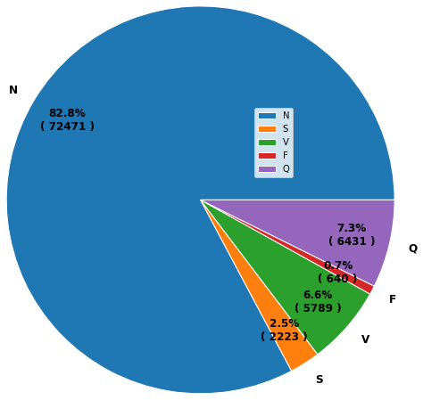

# ECG_Heartbeat_classification
ECG_Heartbeat_classification.  
All required packages are listed in requirements.txt.  
## Data
Data from Kaggle, https://www.kaggle.com/datasets/shayanfazeli/heartbeat  
Data Content  
Arrhythmia Dataset  
Number of Samples: 109446  
Number of Categories: 5  
Sampling Frequency: 125Hz  
Data Source: Physionet's MIT-BIH Arrhythmia Dataset  
Classes: ['N': 0, 'S': 1, 'V': 2, 'F': 3, 'Q': 4]  

80% of data(87554) used to train, and 20% of data (21892) used to test.  
  
  
As shown in the pie chart, class N accounts for 82.8% of the data, meaning that most samples belong to class N. The other four classes make up only 17.2%, with class F in particular representing just 0.7%. This indicates that the dataset is highly imbalanced.  
## Data Preprocessing
As mentioned earlier, the dataset is highly imbalanced. Therefore, when splitting a portion of the training data for validation, I applied a stratified split to preserve the class distribution.  
In addition, all data were standardized using z-score normalization.  
## Model 
I use 4 different models to classify ECG data. All models are trained with AdamW (learning rate 1e-3, weight decay 1e-3) for 100 epochs, with early stopping if the validation loss does not improve for 15 consecutive epochs.  
  
1.**Simple CNN**
The first model is a simple CNN with only three layers and up to 128 channels. It does not use dropout or batch normalization. Training is relatively fast, and this model serves as the baseline.

2.**Four-layer CNN**
The second model consists of four convolutional layers with up to 256 channels. Both dropout and batch normalization are applied.

3.**Residual CNN**
The third model incorporates residual connections and consists of five residual blocks (i.e., ten layers). Dropout and batch normalization are applied. This model has a larger number of parameters and produces larger feature maps, requiring more GPU memory.

4.**Coupled CNN**
The fourth model is a coupled CNN consisting of two convolution + pooling pairs, repeated twice, followed by three fully connected layers for output. This design is based on an architecture from the paper, which I re-implemented. It has more parameters than the residual CNN, but its feature maps are smaller.  
https://ieeexplore.ieee.org/abstract/document/8952723  
  
**Table 1. Models performance comparison**
| Model | parameter | Recall(W)  | Specificity(W) | precision(W) | F1-score(W) | F1-score(M) |  
|----------------|--------|--------|--------|--------|--------|--------|
| Simple CNN | 52,229 | 0.9811 | 0.9494 | 0.9805 | 0.9807 | 0.9012 |  
| Four-layer CNN | 217,925 | 0.9840 | 0.9536 | 0.9835 | 0.9835 | 0.9171 |  
| Residual CNN | 1,354,981 | 0.9844 | 0.9518 | 0.9840 | 0.9840 | 0.9154 |  
| Coupled CNN | 1,686,725 | 0.9872 | 0.9630 | 0.9869 | 0.9869  | 0.9290 |  

**Table 2. Adam v.s AdamW**
| Model | optimization | Recall(W)  | Specificity(W) | precision(W) | F1-score(W) | F1-score(M) |  
|----------------|--------|--------|--------|--------|--------|--------|
| Coupled CNN | Adam | 0.9868 | 0.9661 | 0.9866 | 0.9865 | 0.9290 |  
| Coupled CNN | AdamW | 0.9872 | 0.9630 | 0.9869 | 0.9869 | 0.9201 |  

**Table 3. LrScheduler or not**
| Model | LrScheduler | Recall(W)  | Specificity(W) | precision(W) | F1-score(W) | F1-score(M) |  
|----------------|--------|--------|--------|--------|--------|--------|
| Coupled CNN | used | 0.9869 | 0.9681 | 0.9866 | 0.9867 | 0.9239 |  
| Coupled CNN | none | 0.9872 | 0.9630 | 0.9869 | 0.9869 | 0.9201 |  

**Table 4. Class weights **
| Model | alpha | Recall(M)  | Specificity(M) | precision(M) | F1-score(M) |  Recall(W)  | Specificity(W) | precision(W) | F1-score(W) |  
|----------------|--------|--------|--------|--------|--------|--------|--------|--------|--------|
| Coupled CNN | 0 | 0.9182 | 0.9900 | 0.9412 | 0.9290 | 0.9872 | 0.9630 | 0.9869 | 0.9869 |  
| Coupled CNN | 0.1 | 0.9129 | 0.9911 | 0.9313 | 0.9218 | 0.9865 | 0.9690 | 0.9863 | 0.986 |  
| Coupled CNN | 0.5 | 0.9319 | 0.9896 | 0.8486 | 0.8816 | 0.9775 | 0.9704 | 0.9805 | 0.9785 |  
| Coupled CNN | 1.0 | 0.9437 | 0.9883 | 0.7713 | 0.8266 |  0.9605 | 0.9808 | 0.9749 | 0.9655 |  
